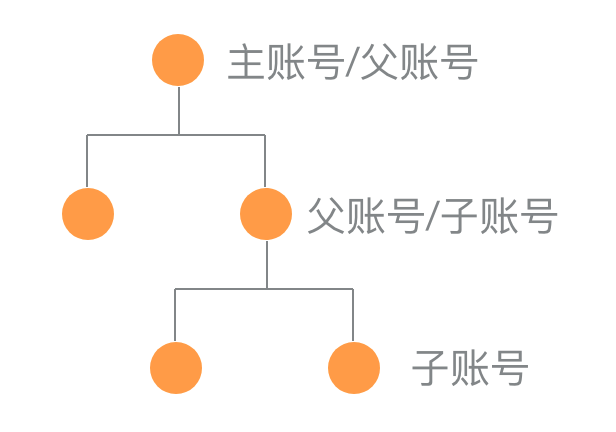
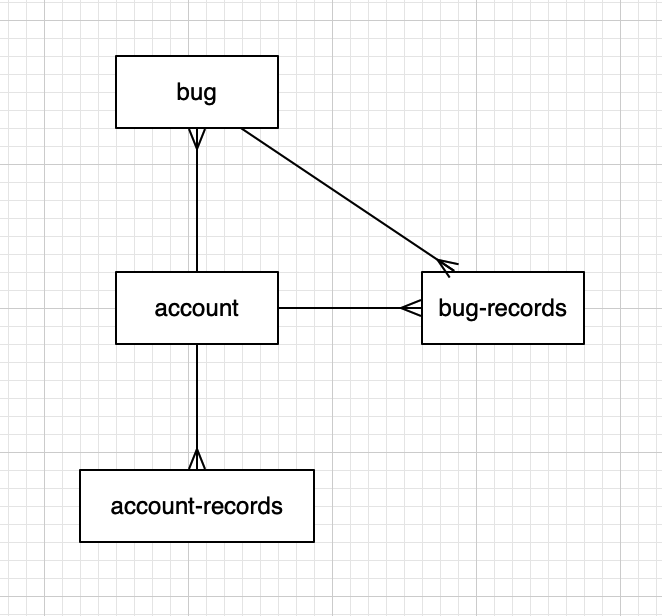

# 引言
##   目的
##   文档约定
##   预期的读者和阅读建议
##   产品的范围
##   参考文献
# 综合描述
##   产品的前景
##   产品的功能
### 账号权限体系
**账号体系**

* 主账号可以操作所有的账号关系（增删查改）
* 父账号仅能操纵自己的子账号
* 可以更换父账号
* 每个账号可以有多个角色，可以单独为某个账号分配权限

**权限体系**

* 权限：访问/修改特定数据的许可
* 任何账号都可以拥有任何权限
* 角色即权限集
* 可以自定义角色

### 数据体系

### 功能体系

1. 账号登陆

2. 管理账号
    1. 新增账号
    2. 删除账号
    3. 查看账号
    4. 分配权限
    5. 设置角色

3. 管理 bug
    1. 新建 bug
    2. 编辑 bug
    3. 删除 bug
    4. 查看 bug
    5. 评论
        1. 编辑评论（显示新评论，旧评论仍然可以查看）
    6. 发送钉钉提醒
4. 管理权限
    1. 编辑角色
    2. 新增角色
    3. 删除角色
    4. 查看角色

##   用户类和特征
##   运行环境
##   设计和实现上的限制
##   假设和依赖
#   外部接口要求
##   用户界面
##   硬件接口
##   软件接口
##   通信接口
#   系统特征
##   说明和优先级
##   激励/响应序列
##   功能需求
#   其他非功能需求
##   性能需求
##   安全设施需求
##   安全性需求
##   软件质量属性
##   业务规则
##   用户文档
#   其他需求
# 附录A   词汇表
# 附录B   分析模型
# 附录C   待确定问题的列表
